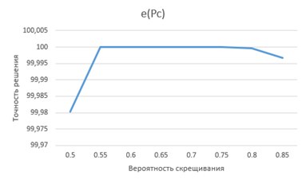
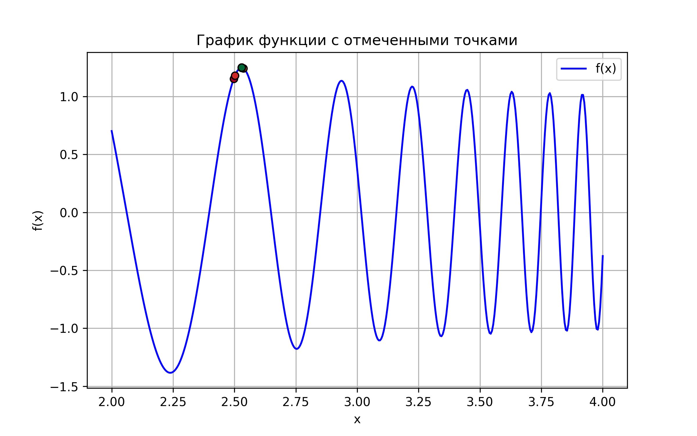

# **ОТЧЕТ ПО ДОМАШНЕМУ ЗАДАНИЮ №1 ПО ДИСЦИПЛИНЕ «Биоинспирированные алгоритмы решения задач защиты информации»**

## **1 Программная реализация генетического алгоритма** 

По условию необходимо было реализовать генетический алгоритм для нахождения максимума функции:  

`f(x) = cos(exp(x)) / sin(ln(x))`  на отрезке `[2; 4]`.

Для реализации алгоритма был выбран язык программирования Golang. Из особенностей реализации можно отметить применение одноточечного скрещивания. В качестве мутации применялась функция, изменяющая значение особи на случайную величину от `-0.05` до `0.05` (в случае выхода за пределы заданного интервала особи присваивалось значение краевой точки). Полный код, реализующий данный алгоритм представлен в файле `geneticalgorithm.go`. Пример работы программы представлен на рисунке 1\.

  
Рисунок 1 – Пример работы алгоритма

## **2 Исследование зависимости результатов работы алгоритма от основных параметров алгоритма** 

На данном этапе выполнения домашнего задания были исследованы зависимости времени работы алгоритма, числа поколений и точности нахождения решения от мощности популяции и вероятностей скрещивания и мутации. Для каждой полученной зависимости был построен график.

### **2.1 Зависимость от мощности популяции**

Зависимость времени работы алгоритма от мощности множества определялась следующим образом. Для каждого из значений 30, 50, 75, 100, 125, 150, 175 и 200 для параметра мощности популяции было произведено по 10 запусков алгоритма и замерено время работы. После этого для каждого из значений было найдено среднее время работы. В результате измерений были получены следующие данные:

| N | 30 | 50 | 75 | 100 | 125 | 150 | 175 | 200 |
| :---: | :---: | :---: | :---: | :---: | :---: | :---: | :---: | :---: |
| t | 5,3 | 1,3 | 2,0 | 3,0 | 3,5 | 4,2 | 5,4 | 6,1 |

Аналогично были рассчитаны значения количества поколений для нахождения решения в зависимости от мощности популяции. Результаты представлены далее:  

| N | 30 | 50 | 75 | 100 | 125 | 150 | 175 | 200 |
| :---: | :---: | :---: | :---: | :---: | :---: | :---: | :---: | :---: |
| n | 33,5 | 42,3 | 38,9 | 37,7 | 41,0 | 39,8 | 40,3 | 41,8 |

Для нахождения точности найденного решения сначала было определено точное значение точки максимума данной функции на заданном отрезке. Было определено, что максимальное значение функции на заданном отрезке принимается при `x = 2,5291437` и равно оно `1,2491`. Результаты нахождения действительного максимума представлены на рисунке 2\. На основе этого по формуле:

 `e = (1 - (|Xдейств. - Xга| / | Xга |)) * 100`  

была рассчитана точность решения, найденного генетическим алгоритмом. В результате получились следующие данные:  

| N | 30 | 50 | 75 | 100 | 125 | 150 | 175 | 200 |
| :---- | :---- | :---- | :---- | :---- | :---- | :---- | :---- | :---- |
| e | 99,98 | 99,92 | 99,98 | 100,00 | 99,93 | 99,98 | 100,00 | 100,00 |


  
Рисунок 2 – Максимальное значение функции на заданном отрезке.

На основе представленных данных были построены графики зависимости данных величин от мощности популяции. Графики зависимости времени работы алгоритма, числа поколений и точности решений представлены на рисунках 3-5 соответственно.

  
Рисунок 3 – График зависимости времени работы от мощности популяции.

  
Рисунок 4 – График зависимости числа поколений от мощности популяции.

  
Рисунок 5 – График зависимости точности решения от мощности популяции.

### **2.2 Зависимость от вероятности скрещивания** 

Аналогично для нахождения зависимости времени работы алгоритма, числа поколений и точности решения от вероятности скрещивания было произведено по 10 запусков алгоритма со значениями вероятности скрещивания `0.05`, `0.08`, `0.11`, `0.14`, `0.17`, `0.20`, `0.23`, `0,25`. После чего для каждого из значений было найдено среднее значение результатов работы. Исходя из этого были получены зависимости описанных характеристик работы алгоритма от параметра вероятность скрещивания. Зависимости представлены в последующих таблицах (для большей точности определения времени работы алгоритма мощность популяции была установлена `200`, а точность найденного решения вычислялась по формуле аналогичной прошлому разделу).

| Pc | 0,50 | 0,55 | 0,60 | 0,65 | 0,70 | 0,75 | 0,80 | 0,85 |
| :---: | :---: | :---: | :---: | :---: | :---: | :---: | :---: | :---: |
| t | 6,2 | 6,3 | 6,5 | 6,5 | 6,6 | 6,8 | 6,5 | 6,4 |

| Pc | 0,50 | 0,55 | 0,60 | 0,65 | 0,70 | 0,75 | 0,80 | 0,85 |
| :---: | :---: | :---: | :---: | :---: | :---: | :---: | :---: | :---: |
| n | 39,9 | 40,7 | 40,8 | 39,4 | 40,3 | 36,3 | 36,2 | 33,0 |

| Pc | 0,50 | 0,55 | 0,60 | 0,65 | 0,70 | 0,75 | 0,80 | 0,85 |
| :---: | :---: | :---: | :---: | :---: | :---: | :---: | :---: | :---: |
| e | 99,98 | 100,00 | 100,00 | 100,00 | 100,00 | 100,00 | 99,99 | 99,99 |

Затем были построены графики данных зависимостей, представленные на рисунках 6-8 соответственно.

  
Рисунок 6 – График зависимости времени работы алгоритма от вероятности скрещивания.

  
Рисунок 7 – График зависимости числа поколений от вероятности скрещивания.

  
Рисунок 8 – График зависимости точности решения от вероятности скрещивания.

### **2.3 Зависимость от вероятности мутации** 

Аналогичный порядок действий был проделан для вероятности мутации, принимавшей значения `0.05`, `0.08`, `0.11`, `0.14`, `0.17`, `0.20`, `0.23` и `0.25`. Исходя из этого были получены зависимости времени работы алгоритма, числа поколений и точности найденного решения от вероятности мутации. Данные зависимости представлены в последующих таблицах:

| Pm | 0,05 | 0,08 | 0,11 | 0,14 | 0,17 | 0,20 | 0,23 | 0,25 |
| :---: | :---: | :---: | :---: | :---: | :---: | :---: | :---: | :---: |
| t | 6,6 | 7,0 | 6,7 | 6,0 | 7,8 | 6,7 | 6,9 | 7,3 |

| Pm | 0,05 | 0,08 | 0,11 | 0,14 | 0,17 | 0,20 | 0,23 | 0,25 |
| :---: | :---: | :---: | :---: | :---: | :---: | :---: | :---: | :---: |
| n | 41,5 | 40,4 | 40,8 | 42,1 | 44,8 | 44,7 | 42,7 | 41,2 |

| Pm | 0,05 | 0,08 | 0,11 | 0,14 | 0,17 | 0,20 | 0,23 | 0,25 |
| :---: | :---: | :---: | :---: | :---: | :---: | :---: | :---: | :---: |
| e | 100,00 | 100,00 | 99,99 | 99,99 | 100,00 | 100,00 | 100,00 | 100,00 |

На основе данных зависимостей были построены графики, представленные на рисунках 9-11 соответственно.

  
Рисунок 9 – График зависимости времени работы алгоритма от вероятности мутации.

  
Рисунок 10 – График зависимости числа поколений от вероятности мутации.

      
Рисунок 11 – График зависимости точности решения от вероятности мутации.

## **3 Найденные решения на графике функции** 

Следующим шагом стало построение графика функции, на котором отмечен лучший результат для каждого из поколений. Лучшее значение для каждого поколения, полученное в ходе выполнения алгоритма и использованное для построения графика представлено в таблице ниже\. Для построения графика с отмеченными точками был написан скрипт на языке программирования Python. Исходный текст данного скрипта представлен в файле `plot.py`. Также для удобства восприятия был добавлен функционал, который отмечает значения более ранних поколений цветами ближе к красному, а результаты последних поколений цветами ближе к зелёному (для читаемости графика рассматривались лишь уникальные значения, полученные различными поколениями).

| Номер поколения | Лучшее значение (особь) |
| :---: | :---: |
| 1 | 2,4972344340 |
| 2 | 2,5023601253 |
| 3-5 | 2,5369055717 |
| 6-12 | 2,5289099216 |
| 13-16 | 2,5291679324 |
| 17-18 | 2,5291437383 |
| 19 | 2,5291436950 |
| 20-21 | 2,5291437151 |
| 22 | 2,5291437105 |
| 23-25 | 2,5291437069 |
| 26-27 | 2,5291437078 |
| 28-48 | 2,5291437086 |

При запуске данного скрипта с представленными значениями был получен график, представленный на рисунке 12\.

  
Рисунок 12 – График функции с лучшими значениями на каждом поколении.

## **4 Сравнение результатов с действительным максимумом**

В итоге при помощи данного алгоритма (при нескольких запусках с различными параметрами) наиболее точное решение, которое удалось получить составило `2,529143708` (параметры запуска: `N \= 200`, `Pc = 0.55-0.75`, `Pm = 0.1`) при действительном значении `2,5291437` (максимальное число знаков после запятой, которое удалось получить).   
Таким образом можно сделать вывод, что алгоритм показал себя хорошо и позволил определить максимум функции на заданном отрезке с точностью не меньше, чем седьмой знак после запятой.

# **ЗАКЛЮЧЕНИЕ**

В ходе данной лабораторной работы был реализован генетический алгоритм поиска максимума функции на заданном отрезке. При помощи данного алгоритма удалось получить решение с хорошей точностью.

Помимо этого, в ходе работы был проанализированы зависимости времени работы алгоритма, числа поколений и точности решения от основных параметров генетических алгоритмов: мощности популяции и вероятностей скрещивания и мутации. По полученным значениям были построены графики, которые в целом подтверждают теоретические принципы работы алгоритма. По мере увеличения мощности популяции покрывается большая область значений, но при этом происходит проигрыш во времени его работы. Время работы алгоритма практически не изменяется при увеличении вероятностей скрещивания и мутации. Возможно, немного увеличивается при увеличении вероятностей, поскольку программе приходится производить больше операций для осуществления операций скрещивания и мутации, но это изменение не столь велико. А вот число поколений, необходимых для нахождения решения и точность найденного решения может значительно измениться при различных вероятностях. При увеличении вероятности скрещивания алгоритму требуется меньшее число поколений для нахождения оптимального решения, поскольку последующие поколения с большей вероятностью перенимают положительные качества предшествующего и получают результат точнее. При увеличении вероятности мутации же может произойти потеря полезных особей, из\-за чего может вырасти число необходимых для нахождения решений поколений и потеряться точность полученного решения.

Финальным результатом работы стало построение графика функции с демонстрацией лучшего значения для каждого из поколения, на котором отчётливо видно, что каждое последующее поколение находит решение, отличающееся от действительного на всё меньшее и меньшее значение.

Таким образом, могу сделать вывод, что генетические алгоритмы действительно хорошо подходят для решения сложных задач, в которых пространство поиска слишком велико для применения традиционных методов (таких как перебор всех возможных вариантов), а также выделить на основе практической работы оптимальные для себя параметры генетического алгоритма, которые лучше всего себя показывают при решении подобных задач:

```
N= 100;  
Pc= 0,65;  
Pm= 0,08.
```